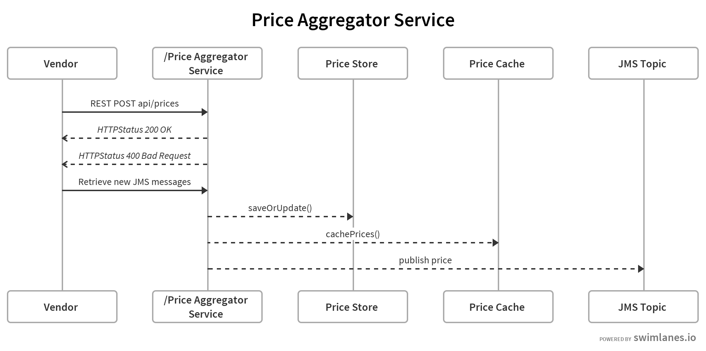
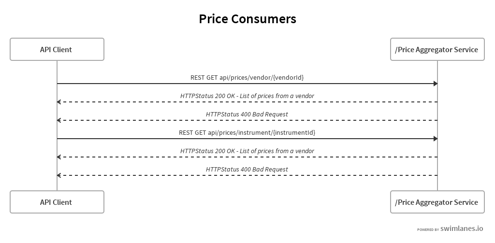
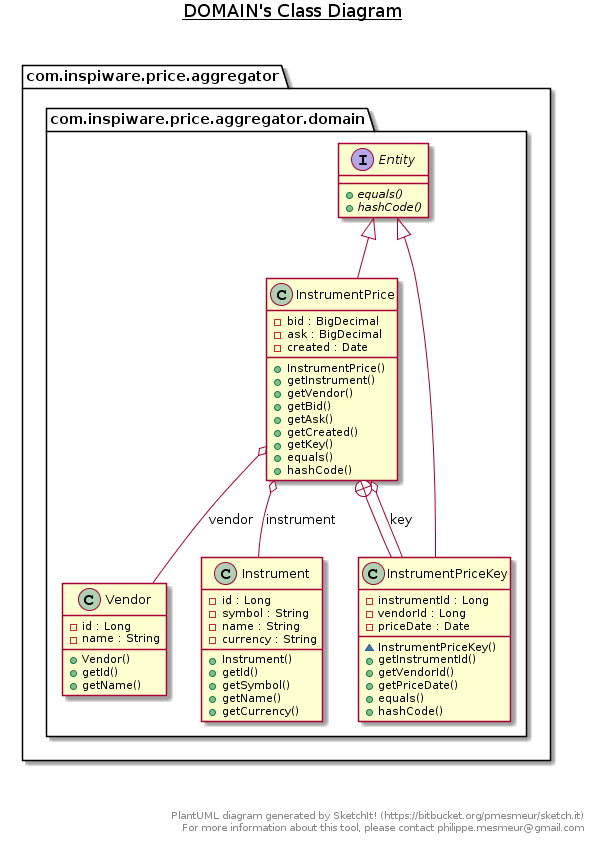

# price-aggregator
This solution is Spring boot, and spring integration based REST service.  

Price aggregator component collect quotes from different sources and store the result in a local store. Localstore type is 
configurable and the default value is set to MAP which initializes a ConcurrentHashMap based store. 

It also caches the prices in a configurable cache. By default it is configured to ehcache but can be configured to any other kind of caches. 

Solution also creates a JMS listener container which is responsible to enable JMS listeners endpoints. 

Below is the sequence diagram for the price feed: 

Price service API client requests to the services are depicted below: 

Class diagram of the domain models are 


## How to run
To run the project locally, use the command:

 ```./gradlew bootRun```

It will start the REST services, start an in-memory ActiveMQ broker and also start the Spring integration flows, 
initialize input/output channels.

## Price Creation

Prices can be created using either JMS messages or REST api calls. 

**1** Jms endpoints to listen to multiple vendor topics:
1. price-feed-vendor1
2. price-feed-vendor2
3. price-feed-vendor3

**2** Using the REST service endpoint /prices, a POST operation with a JSON string payload.

[{"instrument":{"id":10001,"symbol":"AAPL","name":"Apple Inc","currency":"$"},"vendor":{"id":10003,"name":"Vendor3"},"bid":166.26,"ask":170.78,"created":"2018-05-28T15:45:19.291+0000"}]

## Price Fetching

Prices can be retrieved via the REST api as follows:

1. **/prices/instrument/10001**: call to this endpoint will return a list of prices instrument Id 10001 in JSON format.
2. **/prices/vendor/10003**: call to this endpoint will return a list of prices vendor Id 10003 in JSON format.

Prices are also publish on a topic **pub-sub-topic** for any downstream system's consumption.
